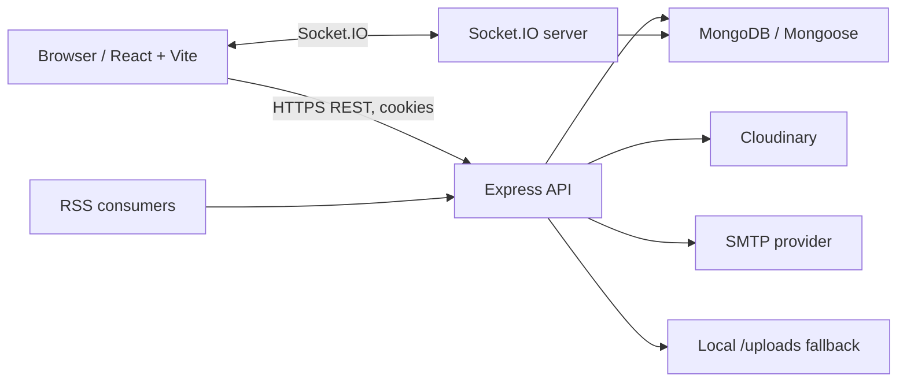
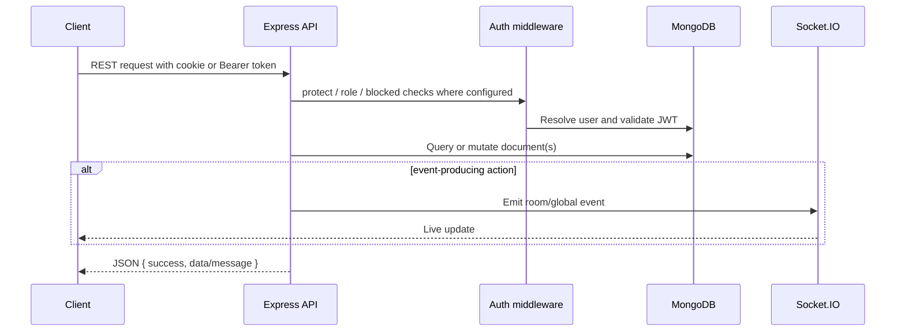
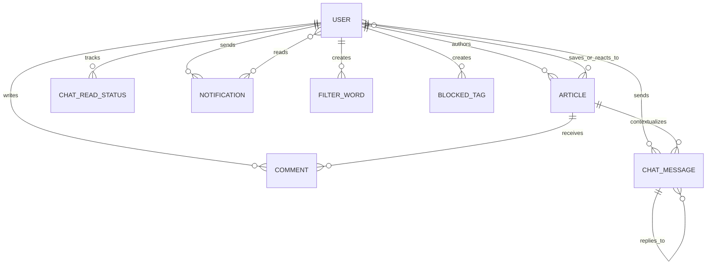
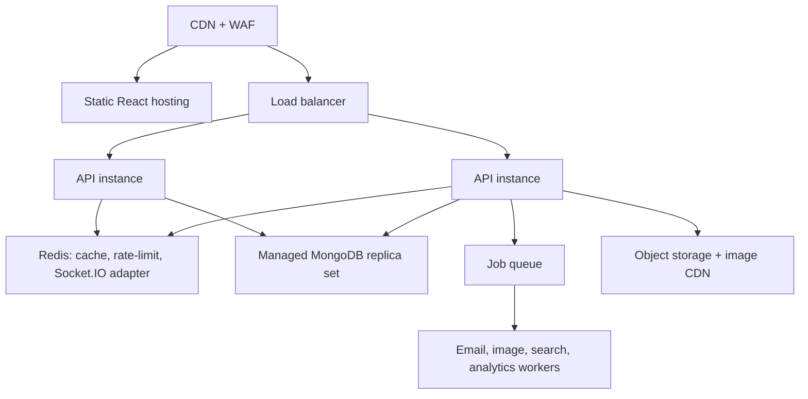

# Southern Waves — Complete Project Documentation

**Version:** 1.0  
**Repository type:** MERN web application  
**Document status:** implementation-aligned analysis and operating guide  
**Last reviewed:** 11 July 2026

## 1. Executive summary

Southern Waves is a student-run digital media platform. It gives students a place to read and publish campus-focused reporting, editorials, feature stories, historical material, official/casual Tea Shop posts, and visual photo essays. The system also supports article discussion, real-time category/tag chat, announcements, subscriptions, role-based editorial tools, and content moderation.

The primary value is a controlled community publishing space: students can contribute and participate, while editors, moderators, and administrators retain publishing and safety controls. The current implementation is a React single-page application backed by an Express API, MongoDB, Cloudinary-or-local image storage, cookies/JWT, and Socket.IO.

### Implemented audience and roles

| Role | Intended user | Implemented authority |
| --- | --- | --- |
| Visitor | Reader who is not signed in | Read published content, browse/search, view RSS and public chat history, subscribe to the newsletter. |
| Student | Registered contributor/reader | Save/like content, comment/chat, manage profile, submit Tea Shop content and Pictures Speak submissions, appeal restrictions. |
| Moderator | Community safety team member | Manage filter words/tags, moderate submissions, comments, flagged articles, user restrictions, and article locks. |
| Editor | Editorial team member | Create/edit articles, manage submissions and comments, and manage article-level content security. |
| Admin | Platform owner | All editorial controls plus user roles, notifications, global chat/comment locks, and account administration. |

### Editorial sections

`news`, `editorial`, `features`, `kyp` (Know Your Past), `tea-shop`, and `pictures-speak` are enforced article categories. The UI presents named experiences for News, Editorial, Features, Know Your Past, Tea Shop, and Picture's Speak.

## 2. Business and functional requirements

### Core capabilities present today

| Module | Purpose | Main behaviors |
| --- | --- | --- |
| Accounts | Establish a known community identity | Registration, login/logout, email-verification link, refresh-token session, profile/avatar/preferences, saved articles. |
| Publishing | Create and distribute student-media content | Draft/pending/published/archived articles, slugs, tags, cover and gallery images, citations/references, featured/trending/breaking/home flags. |
| Discovery | Help readers find relevant stories | Category/tag/search filters, pagination, most-read/most-liked, calculated trending, personal recommendations, RSS. |
| Engagement | Give readers lightweight reactions | Views, share counter, mutually exclusive like/dislike, saved articles, comments and replies. |
| Chat and alerts | Create live community conversations | Category/tag chat rooms, replies, reactions, 15-minute author edits, room read receipts, broadcasts, notifications, Socket.IO events. |
| Moderation | Reduce harmful content and control access | Built-in/custom phrase filters, blocked tags, automated timed blocks, appeals, article flags/queues/locks/bans, global locks. |
| Administration | Support newsroom operations | Dashboards, user-role management, article editor and submissions, comment/moderation/filter/security/system views. |

### Principal user journeys

1. **Reader:** visits a section or uses search → opens a published story → a view is counted → optionally saves/reacts/comments after signing in.
2. **Student contributor:** registers → receives a verification link → signs in → creates a post. Student content is constrained: non-photo posts are published to Tea Shop; Picture's Speak posts are placed in `pending` for review.
3. **Editorial workflow:** editor/admin creates or updates a story with media → assigns lifecycle/visibility flags → publishes it → breaking content is broadcast over Socket.IO.
4. **Community chat:** signed-in user opens a category/tag room → joins its Socket.IO room → reads history → sends, replies to, edits, reacts to, or deletes a permitted message → active listeners receive an event.
5. **Safety workflow:** filter detects prohibited content → the content is flagged or rejected according to its type → the author is temporarily blocked → staff review the queue, optionally approve/unblock, lock, ban, remove, or process an appeal.

### Important implemented business rules

- Registration always assigns the `student` role; a client-supplied role is ignored.
- Article titles produce URL slugs. Duplicate slugs are rejected by MongoDB's unique constraint.
- A student cannot set featured, trending, breaking, or home placement. A student article is forced to Tea Shop/published, except Pictures Speak, which is forced to pending.
- Only an admin may place an article on the home page. At most five articles may be marked `isPushedToHome`; older marked articles are demoted.
- A blocked user cannot create/update/delete articles, comment, chat, edit chat messages, or dislike; the current code still allows likes.
- Messages containing a matching prohibited phrase block the author for one hour. Matching student-created article content is flagged/pending and blocks the author for 24 hours.
- Chat messages are limited to 500 characters; comments to 1,000 characters; article title/lead limits are 120/400 characters.
- Authors can edit a chat message only within 15 minutes. Authors or elevated roles can delete messages.
- Category chat excludes tagged messages. A tagged message is delivered to one Socket.IO room per tag.

## 3. Non-functional characteristics

| Area | Current design | Production target/recommendation |
| --- | --- | --- |
| Responsiveness | React/Vite SPA with desktop/mobile navigation and local theme preferences. | Define and test mobile performance budgets and all supported browsers. |
| Accessibility | UI has some labels/loading affordances and configurable light/dark/black themes. | Audit to WCAG 2.2 AA; include keyboard, contrast, semantic, screen-reader, and reduced-motion tests. |
| Performance | Article indexes; paginated articles and cursor-based chat history; client-built SPA. | CDN/cache static assets, database query profiling, pagination limits, image transformations, and load testing. |
| Availability | Single Express process and one MongoDB connection. | Multi-instance API, managed MongoDB, health/readiness probes, backups, alerts, documented RTO/RPO. |
| Observability | Development Morgan logging and console logging. | Structured logs, request IDs, error tracking, metrics, uptime checks, dashboards, and alerts. |
| Data protection | HTTPS-capable cookies in production and bcrypt password hashing. | Formal retention policy, encryption/key management, privacy controls, and incident response process. |

## 4. System architecture



### Front end

- **Framework:** React 19, Vite 5, React Router 7, Axios.
- **State boundaries:** `AuthContext` manages current account/session state; `ThemeContext` manages theme/style/accent preferences in local storage; `ChatContext` owns Socket.IO lifecycle, room/read/unread state, replies, and notifications.
- **Routing:** public routes cover the home, sections, article details, tags, search, about, pictures, and Tea Shop. Signed-in routes cover chat, saved articles, uploads, onboarding, and settings. `/admin/*` exposes role-gated newsroom views.
- **Styling:** application CSS, responsive components, theme settings (`light`, `dark`, `black`), modern/traditional mode, and configurable accent color.

### Back end

- **Runtime:** Node.js with Express 4, CommonJS modules, HTTP server, Socket.IO 4.
- **Persistence:** MongoDB via Mongoose 8.
- **Media:** Multer uses memory storage; uploads go to Cloudinary if configured, otherwise to `server/uploads`.
- **Mail:** Nodemailer sends registration and newsletter emails through the configured SMTP server.
- **Content safety:** deterministic word/phrase matching against a hardcoded dictionary and optional database-managed terms; blocked tags are checked independently.

### Request lifecycle



### Repository layout

```text
.
├── client/                         React single-page application
│   ├── src/components/             Reusable content, nav, chat, and modal UI
│   ├── src/context/                Authentication, theme, and chat providers
│   ├── src/pages/                  Public, account, and admin route views
│   ├── src/services/api.js         Axios API client and endpoint wrappers
│   └── vercel.json                 SPA rewrite for Vercel static deployment
├── server/                         Express API and real-time service
│   ├── config/db.js                MongoDB connection
│   ├── controllers/                Domain/request handlers
│   ├── middleware/                 Auth, upload, and error middleware
│   ├── models/                     Mongoose schemas
│   ├── routes/                     HTTP route declarations
│   ├── scripts/seed.js             Demonstration-data seeder
│   ├── uploads/                    Local development-media fallback
│   └── utils/                      Email, filtering, Cloudinary helpers
├── package.json                    Root developer scripts
├── README.md                       Entry-point guide
└── DOCUMENTATION.md                This document
```

## 5. Data design

### Entity relationship overview



### Collections and key fields

| Collection | Purpose | Core fields and constraints |
| --- | --- | --- |
| `users` | Accounts and preferences | Unique email; bcrypt password; role enum; profile fields; saved/viewed article references; verification/refresh/reset values; block/appeal state; timestamps. |
| `articles` | Editorial content | Unique slug; required title/lead/body/category/author; tags/media/references; status and feature flags; moderation/security fields; counters and reactions; timestamps. |
| `comments` | Article conversations | Required article/author/text; optional parent comment; approval flag; likes; timestamps. Index on article + descending creation time. |
| `chatmessages` | Community chat | Required user/text/category; tags; broadcast/edit/reply/article context; emoji reactions; timestamps. |
| `chatreadstatuses` | Per-user room state | User, room, last read time. Unique compound index `(user, room)`. |
| `notifications` | System/broadcast/appeal notifications | Title, message, type enum, sender, per-user `readBy` list; timestamps. |
| `newsletters` | Email subscribers | Unique normalized email; confirmation state and timestamp. |
| `filterwords` | Custom moderation terms | Unique normalized word; moderation category/severity; creator; active flag. Index on category. |
| `blockedtags` | Prohibited tags | Unique normalized tag and required creator. |
| `systemsettings` | Global safety switches | Unique `key` (normally `global_settings`); global comment/chat locks. |

### Existing indexes

- `articles`: full-text index over title, lead, body, and tags; category/status/publishedAt; trending/views.
- `comments`: `(article, createdAt desc)`.
- `chatreadstatuses`: unique `(user, room)`.
- `filterwords`: `category`.
- MongoDB unique indexes are declared for emails, slugs, newsletter emails, filter words, blocked tags, and setting keys.

### Data-management recommendations

- Add explicit indexes for high-volume chat retrieval (`category`, `tags`, `createdAt`) and moderation queues (`status`, `isFlagged`, `createdAt`).
- Add audit records for role changes, bans, restrictions, moderation decisions, and global-lock changes.
- Define data-retention/erasure procedures for accounts, chat, analytics, and backups before launch.
- The current model uses hard deletes for articles/comments/chat messages. Use soft delete, restoration windows, and audit metadata where editorial/legal retention requires it.

## 6. Authentication, authorization, and session behavior

### Authentication flow

1. Registration creates a student account, hashes its password with bcrypt, creates a 24-hour verification token, sends a verification email, and issues an access and refresh cookie.
2. Login verifies email/password and `isActive`, then issues a 15-minute access token and a 7-day refresh token.
3. The React Axios client sends cookies (`withCredentials`) and, if present, also attaches `sw_token` from local storage as a Bearer-token fallback.
4. On a 401 response, Axios calls `POST /api/auth/refresh` once and retries queued requests on success.
5. Logout clears server-side refresh-token storage and expires both cookies.

### Authorization matrix

| Action | Visitor | Student | Moderator | Editor | Admin |
| --- | ---: | ---: | ---: | ---: | ---: |
| Read published stories | Yes | Yes | Yes | Yes | Yes |
| Create a story | No | Yes (constrained) | Yes | Yes | Yes |
| Edit own story | No | Yes | Yes | Yes | Yes |
| Edit another story | No | No | No | Yes | Yes |
| Delete own story | No | Yes | Yes | Yes | Yes |
| Delete another story | No | No | No | No | Yes |
| Comment/chat/react | No | Yes | Yes | Yes | Yes |
| Moderate filter/tag/article queues | No | No | Yes | No* | Yes |
| Manage comments | No | Own delete | Yes | Yes | Yes |
| Manage users or roles | No | No | Limited block/unblock | No | Yes |
| Create/delete notifications | No | No | No | No | Yes |

\*Editors have article-level security controls but are not granted the filter/moderation queue endpoints.

### Account restrictions

`checkBlocked` is applied to content-changing article, comment, and chat actions. A timed restriction clears automatically on the next checked request after expiry. Staff can block/unblock non-admin accounts; a blocked user may submit one appeal. Appeal submissions create a notification and Socket.IO status event.

## 7. REST API reference

**Base URL:** `http://localhost:5000/api` in local development, or `VITE_API_URL` in the client.  
**Response envelope:** most endpoints return `{ success: true, data?, message?, count? }`; failures return `{ success: false, message }`.  
**Authentication:** protected endpoints accept the HTTP-only `access_token` cookie or `Authorization: Bearer <JWT>`.

### System and authentication

| Method | Path | Access | Summary |
| --- | --- | --- | --- |
| GET | `/health` | Public | Liveness response with server time. |
| POST | `/auth/register` | Public | Register a student. Accepts profile fields and password. |
| POST | `/auth/login` | Public | Login with `email`, `password`; sets cookies. |
| POST | `/auth/logout` | Signed in | Clears session cookies and stored refresh token. |
| POST | `/auth/refresh` | Cookie | Exchanges refresh cookie for a new access cookie. |
| GET | `/auth/verify/:token` | Public | Completes email verification and redirects to the client login page. |
| GET | `/auth/me` | Signed in | Current user, including populated saved articles. |
| PUT | `/auth/me` | Signed in | Update profile; multipart `avatar` is supported. |
| POST | `/auth/me/saved/:articleId` | Signed in | Save an article. |
| DELETE | `/auth/me/saved/:articleId` | Signed in | Remove a saved article. |
| GET | `/auth/users` | Admin/Moderator | List all users. |
| PUT | `/auth/users/:id/role` | Admin | Set a valid role. |
| PUT | `/auth/users/:id/block` | Admin/Moderator | Restrict a non-admin account; body supports `reason`, `duration` (hours or `forever`). |
| PUT | `/auth/users/:id/unblock` | Admin/Moderator | Remove a restriction. |
| POST | `/auth/appeal` | Signed in | Submit one appeal while blocked; body: `message`. |
| GET | `/auth/appeals` | Admin/Moderator | List pending appeals. |
| PUT | `/auth/users/:id/reject-appeal` | Admin/Moderator | Reject appeal; optional body `response`. |

### Articles and discovery

| Method | Path | Access | Summary |
| --- | --- | --- | --- |
| GET | `/articles` | Public/optional auth | Lists articles. Supports `category`, `status`, `featured`, `trending`, `breaking`, `tag`, `page`, `limit`, `search`, `sort`, `pushedToHome`, `author`, `likedBy`, and `adminView`. Returns pagination metadata. |
| GET | `/articles/recommendations` | Public/optional auth | Personalized or popularity-based recommendations, plus inferred interests. |
| GET | `/articles/most-read` | Public | Popular stories; respects dynamic query `limit` and optional `category`. |
| GET | `/articles/most-liked` | Public | Most liked stories; respects dynamic query `limit` and optional `category`. |
| GET | `/articles/trending` | Public | Engagement/time-decay ranked stories. Admin-curated `isTrending` articles receive a massive score multiplier to always surface first; optional `category`, `limit`. |
| GET | `/articles/tags/trending` | Public | Trending tags; optional `category`. |
| GET | `/articles/my-uploads/stats` | Signed in | Personal and role-specific content dashboard statistics. |
| GET | `/articles/:slug` | Public | Story by slug; increments views, updates signed-in view history, and returns related stories/comments. |
| POST | `/articles` | Signed in, not blocked | Create article. Multipart `coverImage`, `images` (up to 10) or JSON fields; subject to author role rules. |
| PUT | `/articles/:id` | Owner, editor, or admin; not blocked | Update story; same media behavior and role rules. |
| DELETE | `/articles/:id` | Owner or admin; not blocked | Hard-deletes story and its comments. |
| POST | `/articles/:id/share` | Public | Increments share count. |
| POST | `/articles/:id/like` | Signed in | Toggles like and removes dislike. |
| POST | `/articles/:id/dislike` | Signed in, not blocked | Toggles dislike and removes like. |

#### Article request shape

```json
{
  "title": "Campus library adds overnight study hours",
  "lead": "A short required introduction.",
  "dek": "Optional secondary standfirst.",
  "body": "Article body.",
  "category": "news",
  "subCategory": "Campus",
  "historicalYear": null,
  "tags": ["library", "exams"],
  "status": "draft",
  "isFeatured": false,
  "isTrending": false,
  "isBreaking": false,
  "references": [{ "article": "<article-id>", "note": "Related context" }]
}
```

Article categories are `news`, `editorial`, `features`, `kyp`, `tea-shop`, and `pictures-speak`; statuses are `draft`, `pending`, `published`, and `archived`. The server overrides fields that the requesting role is not allowed to set.

### Comments

| Method | Path | Access | Summary |
| --- | --- | --- | --- |
| GET | `/articles/:articleId/comments` | Public | Lists article comments in chronological order. |
| POST | `/articles/:articleId/comments` | Signed in, not blocked | Adds `{ text, parentComment? }`; filters content and sends `comment:new`. |
| GET | `/comments/pending` | Admin/Editor | Lists unapproved comments. |
| GET | `/comments/my-comments` | Signed in | Lists the current user's comments. |
| PUT | `/comments/:id/approve` | Admin/Editor | Marks comment approved. |
| DELETE | `/comments/:id` | Author/Moderator/Editor/Admin | Hard-deletes a comment. |

### Chat

| Method | Path | Access | Summary |
| --- | --- | --- | --- |
| GET | `/chat` | Public | Fetches up to 50 messages. Query: `category`, `tag`, `before` (message-id cursor). |
| GET | `/chat/unread` | Signed in | Rooms, latest message, and unread counts. |
| GET | `/chat/replies` | Signed in | Up to 50 messages replying to the current user. |
| POST | `/chat/read` | Signed in | Records `{ room }` read time. |
| POST | `/chat` | Signed in, not blocked | Creates message with `text`, `category`, `tags`, optional broadcast/reply/article/temp ID. |
| PUT | `/chat/:id` | Author within 15 minutes, not blocked | Edits `{ text, tags? }`. |
| POST | `/chat/:id/react` | Signed in, not blocked | Toggles `{ emoji }` reaction. |
| DELETE | `/chat/:id` | Author or elevated role | Deletes a message. |

### Notifications, newsletters, RSS, and moderation

| Method | Path | Access | Summary |
| --- | --- | --- | --- |
| GET/POST | `/notifications` | Signed in / Admin | List personal read state or create `{ title, message, type }`. |
| PUT | `/notifications/read-all` | Signed in | Mark all notifications read for current user. |
| PUT | `/notifications/:id/read` | Signed in | Mark one notification read. |
| DELETE | `/notifications/:id` | Admin | Delete a notification. |
| POST | `/newsletter/subscribe` | Public | Subscribe `{ email }`; sends welcome mail if SMTP is available. |
| GET | `/rss/:category` | Public | XML feed for a category or `all`; latest 50 published articles. |
| GET/POST | `/filters/tags` | Admin/Moderator | List or add a blocked tag. |
| DELETE | `/filters/tags/:id` | Admin/Moderator | Remove blocked tag. |
| GET/PUT/DELETE | `/filters` or `/filters/:id` | Admin/Moderator | Manage custom filter words. List accepts `category`, `search`. |
| GET | `/filters/defaults` | Admin/Moderator | Return built-in word lists. |
| GET | `/filters/flagged` | Admin/Moderator | List flagged articles. |
| GET | `/filters/pending` | Admin/Moderator | List pending articles. |
| PUT | `/filters/articles/:id/approve` | Admin/Moderator | Publish and clear flag; optional `{ unblockAuthor: true }`. |
| PUT | `/filters/articles/:id/lock` | Admin/Moderator | Set `{ lock: true|false }`. |
| PUT | `/filters/articles/:id/ban` | Admin/Moderator | Set `{ ban: true|false }`. |
| DELETE | `/filters/articles/:id` | Admin/Moderator | Remove a flagged article. |
| GET | `/filters/settings` | **Public in current route configuration** | Reads/creates global chat/comment lock record. |
| PUT | `/filters/settings` | Admin | Changes `{ globalCommentLock, globalChatLock }`. |
| PUT | `/filters/articles/:id/security` | Admin/Editor/Moderator | Changes `{ commentsDisabled, chatDisabled, reason }`. |

### Common errors and validation

| Status | Meaning |
| --- | --- |
| 400 | Missing/invalid input, duplicate document, invalid moderation action, expired chat edit window, or blocked tag. |
| 401 | Missing, invalid, or expired authentication token. |
| 403 | Role is insufficient, account/content is locked, or account is blocked. |
| 404 | Unknown route or missing resource. |
| 500 | Unhandled internal/database/service error. |

## 8. Real-time contract

The API server hosts Socket.IO on the same origin/port as Express. Clients join an application-level room, such as `category:news`, `tag:exams`, or `article:<articleId>`.

| Direction | Event | Payload/use |
| --- | --- | --- |
| Client → server | `chat:joinRoom`, `chat:leaveRoom` | `{ room }` to subscribe/unsubscribe to chat room. |
| Client → server | `article:joinRoom`, `article:leaveRoom` | `{ articleId }` for article-comment updates. |
| Server → client | `chat:message`, `chat:messageEdited`, `chat:messageReacted`, `chat:messageDeleted` | Full message or deletion information, delivered to the relevant room. |
| Server → client | `chat:notification` | Lightweight global message event used for unread badges. |
| Server → client | `comment:new` | New article comment, delivered to `article:<id>`. |
| Server → client | `article:breaking` | Published breaking article. |
| Server → client | `notification:new` | New system/broadcast/appeal notification. |
| Server → client | `user:status` | Block/unblock/appeal state update for a user. |

## 9. Local development and configuration

### Prerequisites

- Node.js 18+ and npm.
- MongoDB (local or hosted) accessible from the API process.
- Optional: Cloudinary account for durable image storage.
- Optional: SMTP provider for verification/newsletter email.

### Commands

| Command | Purpose |
| --- | --- |
| `npm run install:all` | Install server and client packages. |
| `npm run dev` | Run server development watcher and Vite client together on Windows. |
| `npm run dev:server` | Run API with Nodemon. |
| `npm run dev:client` | Run Vite client. |
| `npm run seed` | Load demonstration users/articles/comments. |
| `npm --prefix client run build` | Generate the production client build. |
| `npm --prefix client run lint` | Run the currently configured client linter. |
| `npm --prefix server start` | Run the server without Nodemon. |

### Server environment (`server/.env`)

| Variable | Required | Description |
| --- | --- | --- |
| `NODE_ENV` | Yes | `development`, `test`, or `production`. |
| `PORT` | No | API port; defaults to `5000`. |
| `MONGODB_URI` | Yes | MongoDB connection string. |
| `JWT_SECRET` | Yes | Strong, unique secret for access tokens. |
| `JWT_REFRESH_SECRET` | Yes | Strong, unique secret for refresh tokens. Never rely on the development fallback. |
| `ALLOWED_ORIGINS` | Production | Comma-separated trusted client origins used by CORS/Socket.IO. |
| `CLIENT_URL` | Production | Public client URL used for email redirects and RSS links. |
| `SMTP_HOST`, `SMTP_PORT`, `SMTP_USER`, `SMTP_PASS` | For email | SMTP connection values. |
| `FROM_NAME`, `FROM_EMAIL` | Recommended | Sender identity. |
| `CLOUDINARY_CLOUD_NAME`, `CLOUDINARY_API_KEY`, `CLOUDINARY_API_SECRET` | Recommended | Enables Cloudinary image storage. |

### Client environment (`client/.env`)

| Variable | Required | Description |
| --- | --- | --- |
| `VITE_API_URL` | Production | Full API base ending in `/api`, for example `https://api.example.edu/api`. |

### Safe example configuration

```dotenv
# server/.env
NODE_ENV=development
PORT=5000
MONGODB_URI=mongodb://127.0.0.1:27017/southern_waves
JWT_SECRET=replace-with-a-long-random-secret
JWT_REFRESH_SECRET=replace-with-a-different-long-random-secret
ALLOWED_ORIGINS=http://localhost:5173
CLIENT_URL=http://localhost:5173

# client/.env
VITE_API_URL=http://localhost:5000/api
```

Do not commit either `.env` file. They are ignored by the repository.

## 10. UI/UX guidance

The Southern Waves design guidelines prioritize high-fidelity accessibility, mobile integration, and data visualization.

### Implemented UI/UX patterns

- **Responsive Admin Dashboards:** The entire admin control panel dynamically adapts to all viewports. Form layouts (such as the Article Editor grid) collapse into single-column vertical stacks on mobile, and secondary data columns (e.g. Author name, Joined date, Email address) are hidden using `.hide-mobile` utility helper classes to fit tables cleanly.
- **Interactive Tooltip Charts:** Custom SparkBar sparkline charts support mouse hover and touchscreen swipe gestures. Hovering or touching a bar triggers a floating absolute-positioned tooltip overlay displaying the exact weekday label and view counts.
- **Data Table Scroll Panes:** Admin data tables are wrapped in scroll panes with `max-height: 70vh`. Headers (`thead th`) use `position: sticky; top: 0` so they remain fixed at the top as users scroll through records.
- **Image Lightbox:** Body images inside articles support a clickable zoom lightbox. Features include double-tap/pinch-to-zoom gestures for mobile screens, zoom increment buttons, ESC key dismiss, and absolute pan dragging.

### Guidelines for production quality

- Treat the existing CSS variables as design tokens; publish approved semantic colors, typography, spacing, elevation, breakpoints, and focus states.
- Standardize loading skeletons, empty states, inline validation, retry affordances, confirmation for destructive actions, and offline/error messaging.
- Ensure all dialog traps, menus, chat interactions, and image controls work using keyboard only.
- Test color themes and custom accent colors at AA contrast; never rely on color alone for moderation or status meaning.
- Apply responsive image sizes, `alt` text authoring requirements, and captions for editorial accessibility.

## 11. Security review and release blockers

The following section distinguishes code currently present from safeguards that are still required. It is not a claim of production certification.

### Security controls implemented

- Passwords are hashed with bcrypt.
- Access and refresh JWTs are stored in HTTP-only cookies; cookie `secure` is enabled in production.
- Role middleware is used on most sensitive HTTP routes.
- Origin allow-list is configurable for HTTP CORS and Socket.IO.
- Multer uses in-memory storage, validates image type/name, and caps files at 5 MB.
- Basic content filtering and blocked tags exist; safety actions generate real-time account status events.
- Mongoose schemas enforce many field limits, enums, and uniqueness constraints.
- Production startup now validates required configuration, distinct JWT secrets, and minimum secret length.
- HTTP responses now include request IDs, defensive security headers, and trusted-origin checks for state-changing browser requests.
- Login and registration endpoints are rate-limited; global safety settings require moderator or admin access.
- Socket.IO now authenticates connections using the access token and validates allowed chat rooms/article identifiers before joining.

### Required remediation before public production deployment

| Priority | Finding | Evidence/impact | Required action |
| --- | --- | --- | --- |
| P0 | Content rendering needs explicit sanitization assurance | Article/comment body is stored as strings; the repository has no dedicated server-side sanitization layer. | Define allowed rich-text format, sanitize on write and render, and test XSS payloads. |
| P1 | Comment moderation is internally inconsistent | New comments are immediately `isApproved: true`, while an approval queue exists. | Decide on pre-moderation or post-moderation; enforce it consistently and test visibility. |
| P1 | Local file fallback is not deployment-safe | Cloudinary helper writes into the API filesystem if credentials are absent. | Require object storage in production; use signed uploads, image scanning, transformations, and lifecycle rules. |
| P1 | No request-schema layer is applied consistently | `express-validator` is installed but route handlers mainly use ad hoc validation. | Add schema validation/allow-lists for every request, especially updates and moderation endpoints. |
| P1 | Refresh tokens are stored as raw JWTs | Database compromise permits immediate token reuse until expiry. | Store a hash or opaque rotating token family; detect replay and support device/session revocation. |
| P1 | Sensitive actions lack immutable audit logging | Roles, bans, locks, and moderation edits are not recorded in a dedicated audit log. | Add append-only audit events with actor, target, before/after, source IP/request ID, and retention policy. |
| P2 | No documented privacy/compliance controls | Student data, newsletters, and moderation data have no policy documented. | Obtain legal guidance for jurisdiction; publish privacy/terms/community policy, consent, retention, export/deletion workflow. |
| P2 | `verifiedOnly` currently permits every account | Middleware intentionally bypasses the verification check. | Enforce verification where required by the product policy, or remove unused verification claims/UI. |

### Security release checklist

- [ ] Threat model account/session, editor/admin, upload, chat, search, and moderation abuse paths.
- [ ] Enforce secrets validation and use a managed secret store.
- [ ] Enable rate limits, brute-force protections, CSRF strategy for cookie auth, and CORS only for known origins.
- [ ] Authenticate/authorize WebSocket connections and rooms.
- [ ] Sanitize rich text and validate every API request.
- [ ] Add secure headers, TLS termination, dependency scanning, SAST, and secret scanning.
- [ ] Replace local uploads with managed object storage and malware scanning.
- [ ] Add audit trails, incident response, backup/restore tests, and privacy processes.
- [ ] Complete independent penetration testing before external launch.

## 12. Performance and scalability strategy

### Present implementation

- Article listing uses page/limit pagination and has core article indexes.
- Chat history uses a `before` cursor and returns up to 50 messages.
- Trending/recommendation algorithms calculate engagement values in application memory and aggregate comments.
- Socket.IO broadcasts from one server process.

### Target architecture for growth



### Prioritized improvements

1. Put the client and transformed media behind a CDN; use responsive WebP/AVIF variants and cache immutable assets.
2. Cap API `limit` values, validate pagination/cursors, and add query-specific indexes after profiling real workloads.
3. Move trending/recommendation recalculation to scheduled/background jobs or materialized scores at meaningful scale.
4. Introduce Redis for rate limiting, cached discovery results, queues, and Socket.IO pub/sub when horizontally scaling.
5. Move email, image processing, notifications, and heavy analytics to a durable queue with retry/dead-letter handling.
6. Define SLOs (for example, p95 API latency and error rate) and test with realistic read/chat/upload traffic.

## 13. Testing and quality plan

The server now has a focused Node test suite covering runtime-origin parsing, trusted-origin protection, and Socket.IO room validation. The client still has no automated test suite, and the current coverage is not sufficient for a production release.

| Layer | Recommended scope | Suggested minimum gate |
| --- | --- | --- |
| Unit | Filter matching, roles, lifecycle rules, token helpers, recommendation scoring. | 80% meaningful coverage of server domain logic. |
| API integration | Auth/cookies, all permission boundaries, upload limits, filters, moderation, pagination, error shapes. | All routes have happy-path and unauthorized/invalid-input tests. |
| Client | Context behavior, protected routes, forms, error/loading/empty states, theme accessibility. | Critical flows covered with React Testing Library. |
| End-to-end | Register/login, submit/publish, search, comment/chat, moderation/appeal, admin controls. | Playwright/Cypress tests on every release candidate. |
| Security | OWASP dependency scan, secret scan, SAST, ZAP/DAST against staging, upload/XSS/CSRF tests. | No unresolved high/critical findings. |
| Accessibility | Automated Axe checks plus manual keyboard/screen-reader checks. | No critical violations; documented exceptions only. |
| Performance | Article discovery, login, chat bursts, media upload, WebSocket connection scale. | Meets agreed p95/throughput/error SLOs. |

### Quality commands now available

Run `npm --prefix server test`, `npm --prefix client run lint`, and `npm --prefix client run build` before a UI handoff. Add server linting, formatting, type checking (or TypeScript migration), broader tests, and a CI gate before production release.

## 14. Deployment and DevOps plan

### Current deployment state

The client has a Vercel SPA rewrite. The server is a stateful Express/Socket.IO process and has no Dockerfile, Compose file, CI workflow, infrastructure-as-code configuration, or API hosting configuration in this repository. A static Vercel deployment alone will not run the API or persistent Socket.IO service.

### Recommended delivery pipeline

1. **Pull request:** install exact locked dependencies; lint; unit/API/client tests; build; secret/dependency/SAST scans.
2. **Staging:** deploy immutable client/API artifacts, run migrations/index checks and smoke/E2E tests against isolated staging services.
3. **Approval:** review security scan, test results, environment differences, and rollback target.
4. **Production:** rolling or blue/green API release; cache-busted client asset release; monitor error/latency/auth failure rates.
5. **Rollback:** retain previous immutable artifacts and configuration version; use backward-compatible database changes (expand → migrate → contract).

### Operations baseline

- Containerize the API and publish an explicit Node LTS image.
- Run a managed MongoDB replica set with encrypted backups and point-in-time recovery.
- Host the API where long-lived WebSocket connections are supported; front it with TLS, WAF, and load balancing.
- Add `/health` liveness plus a separate readiness check that verifies required dependencies without leaking secrets.
- Centralize JSON logs, error traces, metrics, and alerts. Track request rate, p95/p99 latency, 4xx/5xx, Socket.IO connections, queue failures, database latency, and disk/object-storage failures.
- Set backup RPO/RTO with owners. At a minimum, regularly restore a backup into an isolated environment and document the result.

## 15. Roadmap and prioritization

| Phase | Outcome | High-priority deliverables |
| --- | --- | --- |
| 0 — Release safety | Make the current system safely deployable | Resolve P0/P1 security items, add tests/CI, enforce config validation, object storage, logs/backups. |
| 1 — Editorial reliability | Make publishing/moderation dependable | Define comment workflow, audit log, revision history, approval states, content scheduling, editor notification flow. |
| 2 — Scale and discovery | Improve reader experience under growth | CDN/images, caching, Redis adapter, background jobs, search service evaluation, measured recommendations. |
| 3 — Community maturity | Improve trust and participation | Granular notification preferences, reporting/blocking, moderation evidence, accessibility completion, privacy/export/delete tooling. |
| 4 — Product intelligence | Guide decisions responsibly | Consent-aware analytics, newsroom dashboards, retention metrics, experimentation only with governance. |

### Risks and mitigations

| Risk | Consequence | Mitigation |
| --- | --- | --- |
| Harmful content or false positives | Community harm or unfair account restrictions | Human review workflow, clear policy/appeals, audit trail, calibrated filters, reporting tools. |
| Weak session/socket controls | Account or real-time data abuse | Complete P0 authentication, rate-limit, and socket authorization work before launch. |
| Single-process infrastructure | Outage or lost live updates during deployment | Load balancing, Redis Socket.IO adapter, health checks, managed data services, tested rollback. |
| Unbounded media/data growth | Cost and degraded performance | Object storage lifecycle rules, upload quotas, pagination, indexes, retention policy. |
| Missing tests | Regressions in publishing/moderation permissions | CI quality gates and test coverage of critical workflows. |
| Privacy obligations for students | Legal/reputational harm | Privacy review, consent and deletion process, minimal data collection, access controls. |

## 16. Definition of ready for production

Southern Waves should be considered ready for an external production launch only when the P0/P1 security findings are fixed and verified, automated tests and CI are operational, real production storage/database/backup/monitoring systems are configured, and the editorial/moderation/privacy policies are approved by the organization responsible for the platform.

Until then, the project is suitable for local development, demonstration, and controlled testing—not an enterprise production assurance claim.
