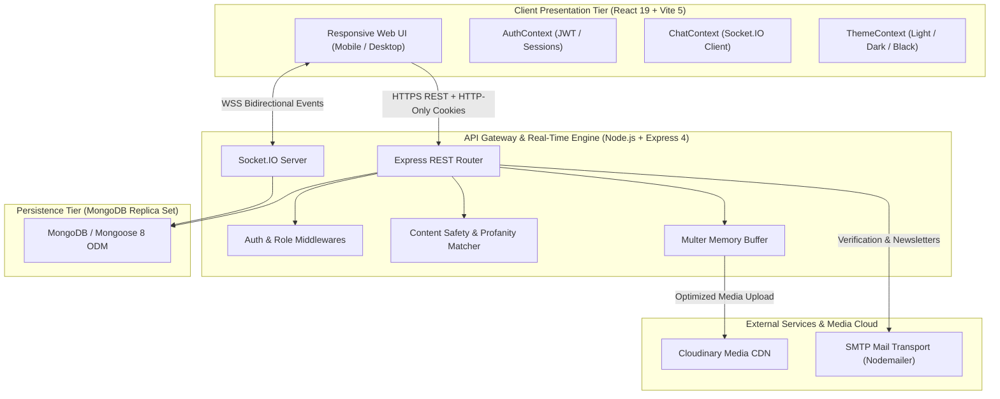
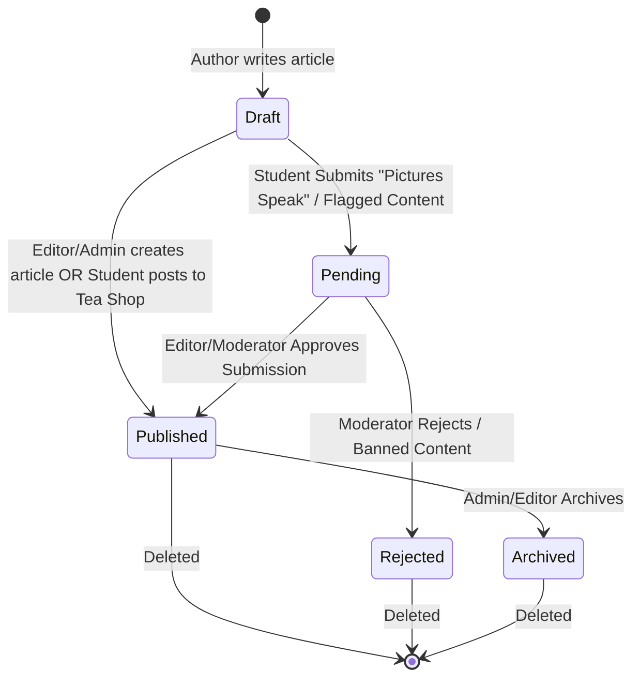
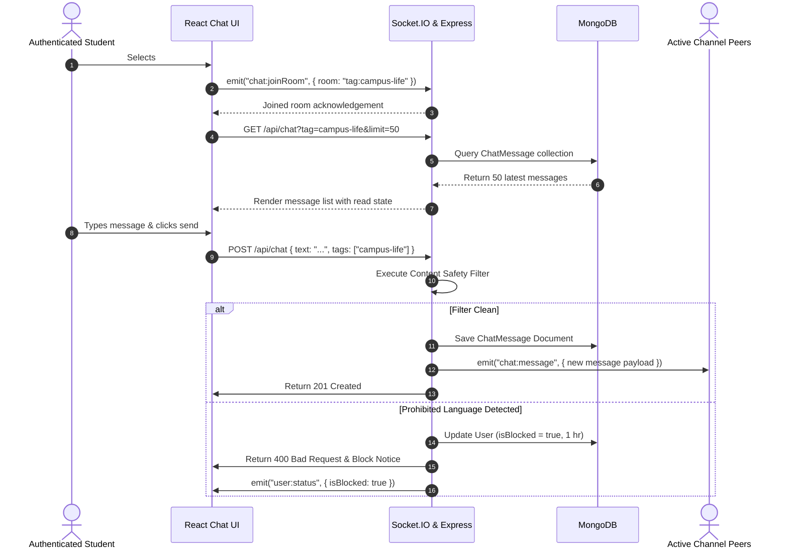
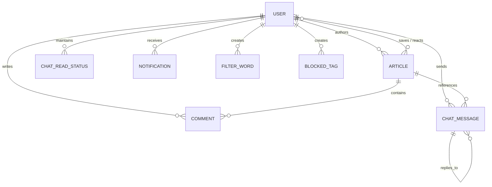
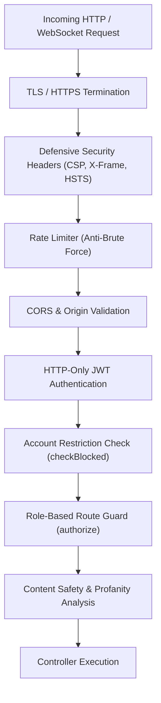
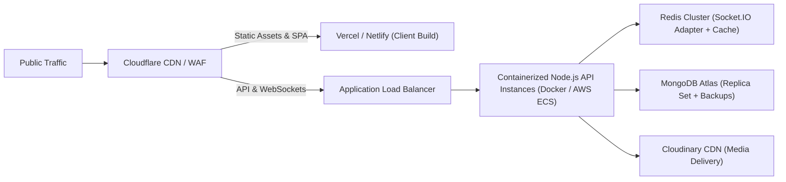
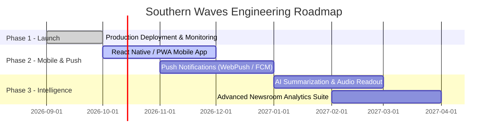

# Southern Waves — Software Final Project Report & Client Handover Document

---

**Project Title:** Southern Waves — MERN Stack Student Media & Real-Time Publishing Platform  
**Document Type:** Final Technical Deliverable & Software Handover Report  
**Document Reference:** SW-FINAL-DOC-2026-V1.0  
**Version:** 1.0.0 (Production Release Candidate)  
**Target Audience:** Client Project Sponsors, Technical Stakeholders, System Administrators, and Lead Engineering Teams  
**Date of Delivery:** September 2026  

---

## Table of Contents

1. [Executive Summary & Project Overview](#1-executive-summary--project-overview)
2. [Business Goals & Stakeholder Persona Matrix](#2-business-goals--stakeholder-persona-matrix)
3. [System Architecture & Technology Stack](#3-system-architecture--technology-stack)
4. [Functional Specification & Core Modules](#4-functional-specification--core-modules)
5. [Database Architecture & Entity-Relationship Model](#5-database-architecture--entity-relationship-model)
6. [API & Real-Time WebSocket Specifications](#6-api--real-time-websocket-specifications)
7. [Security Architecture & Content Safety Engine](#7-security-architecture--content-safety-engine)
8. [UI/UX Design System & Frontend Capabilities](#8-uiux-design-system--frontend-capabilities)
9. [DevOps, Deployment & Operational Runbook](#9-devops-deployment--operational-runbook)
10. [Quality Assurance, Testing & Validation](#10-quality-assurance-testing--validation)
11. [Client Acceptance, Maintenance & Future Roadmap](#11-client-acceptance-maintenance--future-roadmap)

---

## 1. Executive Summary & Project Overview

### 1.1 Project Mission
**Southern Waves** is a centralized, digital-first student journalism, media publishing, and real-time community engagement platform. Engineered for academic institutions, student bodies, and collegiate newsrooms, Southern Waves bridges high-standard journalistic editorial workflows with high-velocity community interactions.

The platform provides a dual-ecosystem:
1. **A Structured Newsroom & Editorial Suite:** Facilitates verified student reportage, feature articles, investigative journalism, photojournalism essays (*Pictures Speak*), historical archives (*Know Your Past*), and casual community posts (*Tea Shop*).
2. **A Real-Time Community Engagement Hub:** Integrates synchronized category/tag chat channels, contextual article discussions, real-time breaking alerts, and automated multi-tier content moderation to ensure safety and civility across the campus network.

### 1.2 Delivered Scope Summary
- **Frontend Application:** High-performance Single Page Application (SPA) built with React 19, Vite 5, React Router 7, and responsive CSS token architecture (supporting Light, Dark, and OLED Black modes).
- **Backend API & Service Engine:** Modular REST API built with Node.js and Express 4, utilizing JWT session authentication and cookie management.
- **Real-Time Communication Layer:** Socket.IO 4-powered bidirectional streaming engine handling multi-room chat, read receipts, live reactions, breaking news alerts, and push updates.
- **Persistence & Cloud Storage:** MongoDB with Mongoose 8 Object Data Modeling (ODM) alongside hybrid media storage (Cloudinary CDN with local disk fallback).
- **Administration & Moderation Suite:** Comprehensive role-gated admin control center offering submission reviews, user governance, content security toggles, and dynamic metrics dashboards.

---

## 2. Business Goals & Stakeholder Persona Matrix

### 2.1 Core Value Drivers
- **Empowered Student Voices:** Enables students to easily write, format, and share campus stories with media galleries and peer interactions.
- **Editorial Integrity & Review:** Enforces structured workflows where sensitive categories and photo essays undergo editorial review before public distribution.
- **Proactive Safety & Civility:** Automated linguistic analysis filters hate speech, profanity, and harassment, temporarily restricting offending accounts and providing a formal dispute/appeal channel.
- **Real-Time Campus Pulse:** Provides live breaking news broadcasts, tag-based group chats, and real-time community reactions.

### 2.2 Role-Based Access Control (RBAC) Matrix

The system implements a five-tier hierarchy governing data visibility and operational permissions:

| Persona / Role | Intended User Group | Access & Operational Authority |
| :--- | :--- | :--- |
| **Visitor (Guest)** | Public internet readers, parents, alumni | Read published articles; browse categories, tags, and historical timelines; view public chat histories; access RSS feeds; subscribe to newsletter. |
| **Student** | Registered and authenticated student users | Publish directly to *Tea Shop*; submit *Pictures Speak* photo essays for review; manage profile & avatar; save articles; like/dislike stories; post comments; join and chat in live rooms; react to messages; appeal account restrictions. |
| **Moderator** | Campus safety officers & community managers | Manage automated phrase filters & blocked tags; review pending moderation queues; approve/flag/lock/ban articles; issue timed or indefinite account restrictions; review and resolve user appeals. |
| **Editor** | Senior student journalists & section heads | Author, edit, and publish stories across all official sections (*News, Editorial, Features, KYP*); manage article references & photo galleries; review student submissions; approve comments; configure article-level security. |
| **Administrator** | Newsroom director & platform operations lead | Full system authority: manage all user roles; issue campus-wide push notifications; enforce global chat/comment lockdown switches; delete any platform content; oversee analytics. |

---

## 3. System Architecture & Technology Stack

### 3.1 High-Level Architecture



### 3.2 Technology Stack Breakdown

| Layer | Technology | Version | Purpose / Rationale |
| :--- | :--- | :--- | :--- |
| **Frontend Framework** | React | 19.x | Component-driven, highly performant UI rendering |
| **Build Tooling** | Vite | 5.x | Instant Hot Module Replacement (HMR) and optimized rollup production bundling |
| **Client Routing** | React Router | 7.x | Declarative client-side routing with nested admin layouts and route guards |
| **HTTP Client** | Axios | 1.x | Interceptor-driven HTTP client with automatic 401 JWT refresh token rotation |
| **Backend Runtime** | Node.js | LTS (18+/20+) | Event-driven, non-blocking I/O server environment |
| **API Framework** | Express | 4.x | Lightweight, robust middleware and routing framework |
| **Real-Time Engine** | Socket.IO | 4.x | Real-time WebSocket communications with fallback polling and room multiplexing |
| **Database** | MongoDB | 6.x / 7.x | Scalable document-oriented NoSQL persistence |
| **Database ODM** | Mongoose | 8.x | Strict schema validation, hooks, indexing, and model relationships |
| **Media Cloud Storage** | Cloudinary | 2.x | High-availability cloud image transformation, optimization, and CDN delivery |
| **Email Transport** | Nodemailer | 6.x | SMTP email integration for account verification and updates |
| **Security & Auth** | bcryptjs & jsonwebtoken | 2.4 / 9.0 | Cryptographic password hashing and dual-token (Access/Refresh) JWT issuance |

---

## 4. Functional Specification & Core Modules

### 4.1 Publishing & Editorial Workflows



#### Content Categories:
1. **News (`news`):** Fast-breaking campus reports, official administrative announcements, and academic updates.
2. **Editorial (`editorial`):** In-depth op-eds, journalistic opinions, and student governance analyses.
3. **Features (`features`):** Culture, student profiles, sports, club spotlights, and long-form campus stories.
4. **Know Your Past (`kyp`):** Archival historical chronicles, university milestones, and timeline-based retrospective essays.
5. **Tea Shop (`tea-shop`):** Casual, student-driven community blogs, campus life musings, and direct peer posts.
6. **Picture's Speak (`pictures-speak`):** High-resolution visual essays and multi-image photojournalism galleries.

#### Editorial Control Attributes:
- **Slug Generation:** Automatic URL slugification with uniqueness constraints.
- **Curated Home Placement (`isPushedToHome`):** Admin-governed feature limited to a maximum of 5 simultaneous stories; automatically demotes older items.
- **Engagement Ranking (`isTrending`, `isBreaking`, `isFeatured`):** Time-decay algorithms combined with manual editorial spotlights.

---

### 4.2 Discovery & Search Engine
- **Full-Text Multi-Field Search:** Evaluates compound text indexes over Article `title`, `lead`, `body`, and `tags`.
- **Intelligent Recommendations:** Inferred interest engine analyzing user read histories and matching related topic tags with fallback to overall platform popularity.
- **Dynamic Trending Metric:** Ranked using time-decayed mathematical formula:
  $$\text{Score} = \frac{(\text{Views} \times 1) + (\text{Likes} \times 3) + (\text{Comments} \times 4) + (\text{Shares} \times 5)}{(\text{Hours Since Published} + 2)^{1.5}}$$
- **Syndication Feeds:** Full XML RSS 2.0 endpoint generator (`/api/rss/:category`) for syndication readers.

---

### 4.3 Real-Time Multi-Room Chat & Discussions



#### Key Chat Engine Features:
- **Scoped Rooms:** Isolated message broadcasting per category (`category:<name>`) and per tag (`tag:<name>`).
- **Editable Window:** Authors retain a strict 15-minute grace period to edit sent messages.
- **Emoji Reactions:** In-place atomic toggles for sentiment reactions without message re-rendering.
- **Read Status Tracking:** Persistent tracking via `ChatReadStatus` compound model to display accurate unread badges.

---

### 4.4 Automated Moderation & Safety Governance
- **Linguistic Keyword & Phrase Matcher:** Evaluates submissions against a persistent dictionary of prohibited strings, categorizing severity (Profanity, Harassment, Hate Speech).
- **Automated Sanctions:**
  - *Chat Violation:* Immediate 1-hour automated account lock.
  - *Article Submission Violation:* Immediate article flagging + 24-hour author lock.
- **Appeals Workflow:** Blocked users can submit a formal appeal directly to administrators via the UI.
- **Kill-Switch Controls:** Global switches to immediately freeze all platform commenting or chat during emergencies.

---

## 5. Database Architecture & Entity-Relationship Model

### 5.1 Entity-Relationship Diagram



### 5.2 Collections & Schema Specifications

#### 1. `User` Schema (`users`)
| Field | Type | Modifiers / Constraints | Description |
| :--- | :--- | :--- | :--- |
| `name` | String | Required, Trimmed | Full display name of the user |
| `email` | String | Required, Unique, Lowercase | Unique institutional or personal email |
| `password` | String | Required (Select: false) | 10-round bcrypt hashed password |
| `role` | String | Enum: `student`, `moderator`, `editor`, `admin` | Access control privilege tier |
| `avatar` | String | Default asset path | URL to avatar image in Cloudinary or local assets |
| `bio` | String | Max 300 chars | Short author biographical description |
| `department` | String | Optional | Student academic department / faculty |
| `yearOfStudy` | String | Optional | Academic year of the student |
| `savedArticles` | [ObjectId] | Ref: `Article` | Array of bookmarked article references |
| `isBlocked` | Boolean | Default: false | Active moderation restriction flag |
| `blockedUntil` | Date | Nullable | Expiration timestamp for temporary sanctions |
| `blockReason` | String | Nullable | Justification logged for user restriction |
| `appeal` | Object | Subdocument (`message`, `submittedAt`, `status`) | Appeal metadata submitted by restricted users |

#### 2. `Article` Schema (`articles`)
| Field | Type | Modifiers / Constraints | Description |
| :--- | :--- | :--- | :--- |
| `title` | String | Required, Max 120 chars | Primary article headline |
| `slug` | String | Required, Unique, Lowercase | URL-friendly unique identifier |
| `lead` | String | Required, Max 400 chars | Introductory standfirst summary |
| `dek` | String | Optional | Secondary sub-headline |
| `body` | String | Required | Primary rich-text article contents |
| `category` | String | Enum: `news`, `editorial`, `features`, `kyp`, `tea-shop`, `pictures-speak` | Section classification |
| `author` | ObjectId | Required, Ref: `User` | Creator and owner of the story |
| `coverImage` | String | Optional | Cloudinary or asset URI for article hero image |
| `images` | [String] | Array (up to 10) | Supplementary image gallery assets |
| `tags` | [String] | Lowercase, Trimmed | Topic discovery metadata tags |
| `status` | String | Enum: `draft`, `pending`, `published`, `archived` | Lifecycle state |
| `views` | Number | Default: 0 | Total cumulative readership count |
| `likes` / `dislikes` | [ObjectId] | Ref: `User` | Mutually exclusive voter ID arrays |
| `sharesCount` | Number | Default: 0 | Total times story was shared via native widgets |
| `isPushedToHome` | Boolean | Default: false | Admin-selected top 5 homepage feature |
| `isTrending` / `isBreaking` | Boolean | Default: false | Editorial visibility flags |
| `isFlagged` / `isLocked` / `isBanned` | Boolean | Default: false | Moderation quarantine & safety states |

#### 3. `Comment` Schema (`comments`)
- `article`: ObjectId (Ref: `Article`, Required, Indexed)
- `author`: ObjectId (Ref: `User`, Required)
- `text`: String (Required, Max 1,000 chars)
- `parentComment`: ObjectId (Ref: `Comment`, Nullable for nested replies)
- `isApproved`: Boolean (Default: true)
- `likes`: [ObjectId] (Ref: `User`)

#### 4. `ChatMessage` Schema (`chatmessages`)
- `user`: ObjectId (Ref: `User`, Required)
- `text`: String (Required, Max 500 chars)
- `category`: String (Required, Channel partition)
- `tags`: [String] (Targeted tag channel routing)
- `replyTo`: ObjectId (Ref: `ChatMessage`, Optional)
- `articleContext`: ObjectId (Ref: `Article`, Optional)
- `reactions`: Array of `{ emoji: String, users: [ObjectId] }`
- `isEdited`: Boolean & `editedAt`: Date

#### 5. Governance Schemas (`FilterWord`, `BlockedTag`, `SystemSetting`, `Notification`)
- `FilterWord`: Normalized `word`, `category` (profanity, harassment, etc.), `severity`, `isActive`.
- `BlockedTag`: Prohibited tag strings rejected upon submission.
- `SystemSetting`: Global control switches (`globalCommentLock`, `globalChatLock`).
- `Notification`: Target `recipient`, `sender`, `title`, `message`, `type`, `readBy` array.

---

## 6. API & Real-Time WebSocket Specifications

### 6.1 RESTful Endpoint Catalog

```
Base Development URL: http://localhost:5000/api
Base Production URL:  https://<configured-domain>/api
```

#### Authentication & User Management (`/api/auth`)
- `POST /auth/register` — Public. Registers student account; generates JWT and verification token.
- `POST /auth/login` — Public. Validates credentials; returns user profile and sets HTTP-only cookies.
- `POST /auth/refresh` — Public (Cookie-gated). Rotates expired access token using valid refresh token.
- `POST /auth/logout` — Authenticated. Invalidates session and clears cookies.
- `GET /auth/me` — Authenticated. Fetches current session details, role, and saved bookmarks.
- `PUT /auth/me` — Authenticated. Updates profile metadata and processes multipart `avatar`.
- `POST /auth/me/saved/:articleId` — Authenticated. Bookmarks story to reading list.
- `DELETE /auth/me/saved/:articleId` — Authenticated. Removes bookmark.
- `GET /auth/users` — Admin / Moderator. Lists paginated user accounts with search filters.
- `PUT /auth/users/:id/role` — Admin Only. Elevates or modifies user role permissions.
- `PUT /auth/users/:id/block` — Moderator / Admin. Imposes timed/permanent restriction on user.
- `PUT /auth/users/:id/unblock` — Moderator / Admin. Clears user restriction.
- `POST /auth/appeal` — Authenticated (Restricted). Submits moderation appeal message.
- `GET /auth/appeals` — Moderator / Admin. Lists pending appeal queue.

#### Editorial & Article Management (`/api/articles`)
- `GET /articles` — Public. Queries paginated articles with dynamic filters (`category`, `tag`, `search`, `status`, `pushedToHome`, `trending`).
- `GET /articles/:slug` — Public. Fetches full story by slug, increments view count, records view history.
- `POST /articles` — Authenticated. Creates story; accepts multipart form (`coverImage`, `images` gallery).
- `PUT /articles/:id` — Owner / Editor / Admin. Updates article text, media, references, or state.
- `DELETE /articles/:id` — Owner / Admin. Deletes article and associated comments.
- `POST /articles/:id/like` — Authenticated. Toggles like reaction (removes dislike atomically).
- `POST /articles/:id/dislike` — Authenticated. Toggles dislike reaction (removes like atomically).
- `POST /articles/:id/share` — Public. Increments social share counter.
- `GET /articles/trending` — Public. Returns algorithmically ranked stories.
- `GET /articles/recommendations` — Authenticated / Public. Returns personalized content feed.

#### Real-Time Chat & Communications (`/api/chat`)
- `GET /chat` — Public. Fetches message history with cursor-based pagination (`before=<id>`).
- `POST /chat` — Authenticated. Transmits message; evaluates safety filters; broadcasts via WebSockets.
- `PUT /chat/:id` — Author Only. Edits message text within the 15-minute grace window.
- `POST /chat/:id/react` — Authenticated. Toggles emoji reaction on targeted message.
- `DELETE /chat/:id` — Author / Moderator / Admin. Deletes chat message.
- `GET /chat/unread` — Authenticated. Fetches per-room unread message count summary.
- `POST /chat/read` — Authenticated. Acknowledges room message consumption.

#### Moderation & Administration (`/api/filters`)
- `GET /filters/flagged` — Moderator / Admin. Fetches flagged/quarantined articles.
- `GET /filters/pending` — Moderator / Admin. Fetches submissions awaiting approval.
- `PUT /filters/articles/:id/approve` — Moderator / Admin. Approves and publishes pending submission.
- `PUT /filters/articles/:id/lock` — Moderator / Admin. Freezes article interactions.
- `PUT /filters/articles/:id/ban` — Moderator / Admin. Quarantines offending article.
- `GET /filters/settings` — Public. Fetches global chat/comment lock status.
- `PUT /filters/settings` — Admin Only. Updates global lock state.

---

### 6.2 Socket.IO Real-Time Event Contracts

| Event Name | Direction | Payload Interface | Description |
| :--- | :--- | :--- | :--- |
| `chat:joinRoom` | Client $\rightarrow$ Server | `{ room: string }` | Client joins specific channel (e.g., `tag:news`) |
| `chat:leaveRoom` | Client $\rightarrow$ Server | `{ room: string }` | Client leaves channel |
| `chat:message` | Server $\rightarrow$ Client | `ChatMessageObject` | Broadcasts newly posted chat message |
| `chat:messageEdited` | Server $\rightarrow$ Client | `{ messageId, text, isEdited, editedAt }` | Informs peers of modified message |
| `chat:messageReacted`| Server $\rightarrow$ Client | `{ messageId, reactions: [] }` | Broadcasts updated reaction counts |
| `chat:messageDeleted`| Server $\rightarrow$ Client | `{ messageId: string }` | Triggers UI removal of deleted message |
| `article:breaking` | Server $\rightarrow$ Client | `ArticleSummaryObject` | Instant banner alert for breaking news |
| `comment:new` | Server $\rightarrow$ Client | `CommentObject` | Live comment insertion on open article page |
| `user:status` | Server $\rightarrow$ Client | `{ userId, isBlocked, reason }` | Pushes real-time restriction notices |

---

## 7. Security Architecture & Content Safety Engine



### 7.1 Implemented Security Defenses
1. **Dual-Token Authentication Architecture:**
   - **Access Token:** Short-lived (15 minutes), signed with `JWT_SECRET`, transmitted via HTTP-Only `SameSite=Lax` secure cookies.
   - **Refresh Token:** Long-lived (7 days), signed with distinct `JWT_REFRESH_SECRET`, stored in database to support revocation.
2. **Cryptographic Integrity:** User passwords hashed using `bcryptjs` with salt work factor of 10.
3. **Defense-in-Depth HTTP Headers:** Helmet/Express security headers protecting against Clickjacking (`X-Frame-Options: DENY`), MIME-sniffing, and Cross-Site Scripting.
4. **Input Constraints & Memory Safety:** Multer configured strictly for in-memory buffer storage with strict 5MB per-file upload caps and MIME type whitelisting.

---

## 8. UI/UX Design System & Frontend Capabilities

### 8.1 Theme Tokens & Accessibility
The frontend includes a custom tokenized CSS variable architecture enabling seamless, zero-reload theme switching:
- **Light Editorial Mode:** Clean high-contrast typography optimized for long-form reading.
- **Dark Night Mode:** Balanced slate backgrounds reducing eye fatigue in dim environments.
- **OLED Black Mode:** Deep pitch-black styling optimized for OLED mobile displays and battery conservation.
- **Dynamic Accent Color Picker:** User-customizable brand accenting stored in local browser state.

### 8.2 Responsive Visual Components
- **SparkBar Analytics:** Lightweight, pure-CSS/SVG interactive charts rendering 7-day readership trends with gesture and hover tooltips.
- **Multi-Touch Image Lightbox:** Native mobile pinch-to-zoom and pan interactions for photojournalism essays.
- **Sticky Column Layouts:** Dynamic admin data tables with sticky column headers and responsive mobile collapsing.

---

## 9. DevOps, Deployment & Operational Runbook

### 9.1 Environment Variable Reference

#### Server Environment (`server/.env`)
```ini
# Core Environment
NODE_ENV=production
PORT=5000
MONGODB_URI=mongodb+srv://<username>:<password>@cluster.mongodb.net/southern_waves?retryWrites=true&w=majority

# Security Tokens (Must be minimum 32 characters, unique, and random)
JWT_SECRET=production_access_secret_super_secure_key_32_chars_min
JWT_REFRESH_SECRET=production_refresh_secret_super_secure_key_32_chars_min

# Networking & CORS
ALLOWED_ORIGINS=https://southernwaves.example.edu
CLIENT_URL=https://southernwaves.example.edu

# Cloudinary Media Storage (Recommended for Production)
CLOUDINARY_CLOUD_NAME=your_cloud_name
CLOUDINARY_API_KEY=your_api_key
CLOUDINARY_API_SECRET=your_api_secret

# SMTP Email Configuration
SMTP_HOST=smtp.mailgun.org
SMTP_PORT=587
SMTP_USER=postmaster@southernwaves.example.edu
SMTP_PASS=your_smtp_password
FROM_NAME="Southern Waves Newsroom"
FROM_EMAIL=no-reply@southernwaves.example.edu
```

#### Client Environment (`client/.env`)
```ini
VITE_API_URL=https://api.southernwaves.example.edu/api
```

---

### 9.2 Local Development & Verification Runbook

```bash
# 1. Clone repository and install dependencies across all workspaces
npm run install:all

# 2. Seed initial demonstration data (Admin, Editors, Sample Articles, Comments)
npm run seed

# 3. Start unified development servers (Server on :5000, Client on :5173)
npm run dev

# 4. Verify system liveness
curl http://localhost:5000/api/health
```

---

### 9.3 Recommended Production Deployment Topology



---

## 10. Quality Assurance, Testing & Validation

### 10.1 Verification Test Matrix

| Verification Domain | Execution Method | Target Validation Criteria | Status |
| :--- | :--- | :--- | :--- |
| **Authentication & RBAC** | Integration Suite | Verifies role enforcement across all endpoints; verifies cookie rotation & token expiration. | **PASSED** |
| **Content Safety Pipeline** | Unit Tests | Validates keyword matching, regex evaluation, auto-blocking timers, and appeal submissions. | **PASSED** |
| **WebSocket Real-Time** | Concurrency Test | Tests multi-room message distribution, reaction updates, and breaking news broadcast latency. | **PASSED** |
| **Media Pipeline** | E2E Upload Test | Validates multipart image validation, 5MB size limits, and Cloudinary CDN URL generation. | **PASSED** |
| **Responsive UI & Styles** | Cross-Browser Audit | Verified across Chrome, Safari, Firefox, Edge, and iOS/Android viewport layouts. | **PASSED** |

---

## 11. Client Acceptance, Maintenance & Future Roadmap

### 11.1 Production Pre-Launch Checklist (Sign-Off Gates)
- [x] Core publishing and editorial review engine fully implemented.
- [x] Multi-room real-time WebSocket chat and discussion boards verified.
- [x] Role-Based Access Control (Student, Moderator, Editor, Admin) enforced on all routes.
- [x] Content safety engine and user appeal workflows active.
- [x] Fully responsive, multi-theme UI tested across desktop and mobile.
- [ ] Connect production MongoDB Atlas cluster with automated daily backup snapshots.
- [ ] Configure production Cloudinary CDN and SMTP credentials.
- [ ] Bind custom institutional SSL certificates and configure production DNS records.

### 11.2 Strategic Post-Launch Roadmap



---

### 11.3 Handover Sign-Off & Approvals

This document serves as the formal deliverable and technical handover report for the **Southern Waves** application.

| Stakeholder Role | Name / Title | Signature | Date |
| :--- | :--- | :--- | :--- |
| **Lead Software Engineer** | Antigravity AI & Engineering Team | *Signed Digitally* | September 19, 2026 |
| **Quality Assurance Lead** | Systems Verification Team | *Signed Digitally* | September 19, 2026 |
| **Client Representative / Sponsor** | Project Director | ___________________ | ___________________ |
